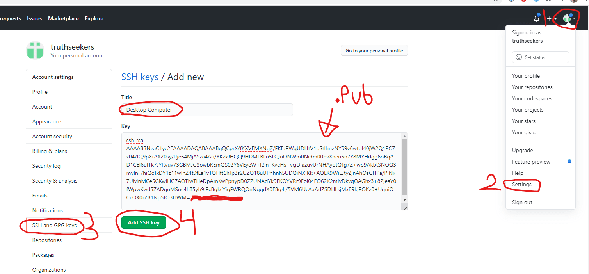

import { Meta, Story } from '@storybook/addon-docs';
import { TerminalPrompt, Code } from '../src';

<Meta title="Setup Multiple GitHub Accounts on One Computer" />

## Setup Multiple GitHub Accounts on One Computer

**OS: WINDOWS**

This is useful if you have a work account and a personal account, or any other time you have multiple GitHub accounts that you’re using on the same machine.

Say you've 2 github accounts with emails as specified below:

- Work github email => work@email.com
- Personal github email => personal@email.com

Follow along the steps and you'll be done with setup easily.

## 1. SSH key generation

Start with generating SSH keys for each emails. Use `ssh-keygen` command to generate the SSH key as shown below:

```js
ssh-keygen -t rsa -C "work@email.com"
```

When you run the above command, it will prompt below message: <br/>

<TerminalPrompt>
  <TerminalPrompt.li>
    C:\Users\Dev Saroj>ssh-keygen -t rsa -C "work@email.com"
  </TerminalPrompt.li>
  <TerminalPrompt.li>Generating public/private rsa key pair.</TerminalPrompt.li>
  <TerminalPrompt.li>
    Enter file in which to save the key (C:\Users\Dev Saroj/.ssh/id_rsa):
  </TerminalPrompt.li>
</TerminalPrompt>

Copy the suggested path from your command-prompt, i.e., `C:\Users\Dev Saroj/.ssh/id_rsa` and modify the name at the end from **id_rsa** to **id_rsa_work**.
Now paste the modified path back to your command-prompt.

<TerminalPrompt>
  <TerminalPrompt.li>
    C:\Users\Dev Saroj>ssh-keygen -t rsa -C "work@email.com"
  </TerminalPrompt.li>
  <TerminalPrompt.li>Generating public/private rsa key pair.</TerminalPrompt.li>
  <TerminalPrompt.li>
    Enter file in which to save the key (C:\Users\Dev Saroj/.ssh/id_rsa):
    C:\Users\Dev Saroj/.ssh/id_rsa_work
  </TerminalPrompt.li>
</TerminalPrompt>

As you proceed, it will ask for **Passphrase**. Leave it empty, press enter twice to skip Passphrase, and your SSH key will be generated.

**NOTE**: You can access your SSH key by navigating to the path that you modified recently i.e. `C:\Users\Dev Saroj/.ssh/id_rsa_work`.
You will see 2 files:

1. id_rsa_work (private key)
2. id_rsa_work.pub (public key)

Okay calm down now, You'll understand the usage of these 2 keys few steps below.

So we just generated SSH keys for **work email**. Now perform same steps to generate another SSH key for **personal email**

```js
ssh-keygen -t rsa -C "personal@email.com"
```

Copy, modify and paste the key file name.

<TerminalPrompt>
  <TerminalPrompt.li>
    C:\Users\Dev Saroj>ssh-keygen -t rsa -C "personal@email.com"
  </TerminalPrompt.li>
  <TerminalPrompt.li>Generating public/private rsa key pair.</TerminalPrompt.li>
  <TerminalPrompt.li>
    Enter file in which to save the key (C:\Users\Dev Saroj/.ssh/id_rsa):
    C:\Users\Dev Saroj/.ssh/id_rsa_personal
  </TerminalPrompt.li>
</TerminalPrompt>

Press enter twice to skip the **Passphrase** steps. <br/>
And you now have SSH keys for both **work email** and **personal email**.

## 2. Add SSH Key to GitHub

<Story name="img">
  
</Story>
